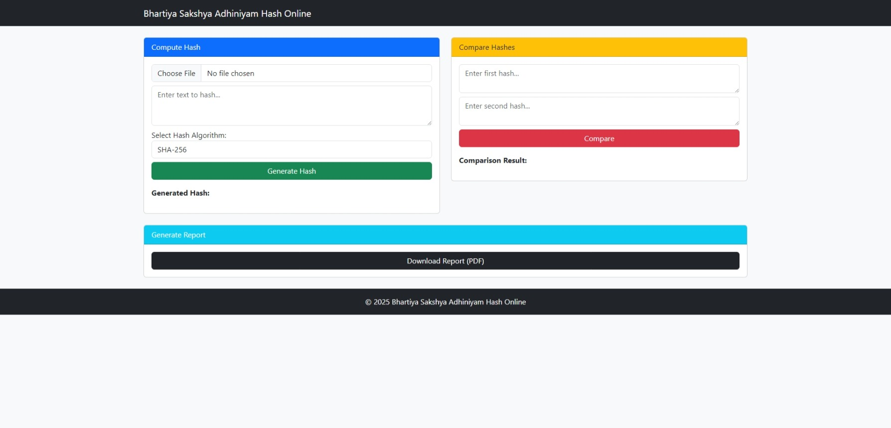
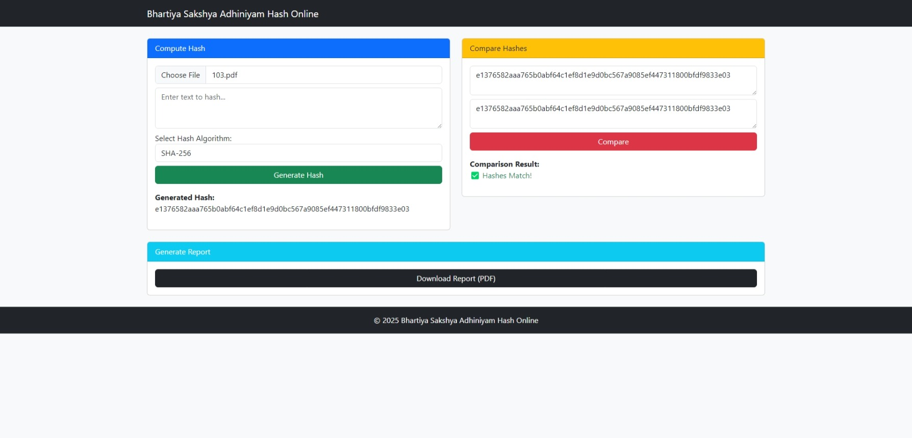
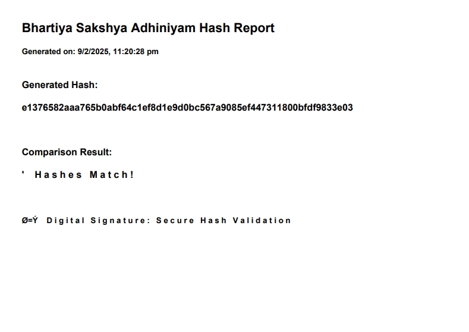

# Bhartiya Sakshya Adhiniyam Hash Online





## 🔗 Demo
[Live Demo](https://isrgrajan.github.io/Bhartiya-Sakshya-Adhiniyam-Hash-Online/)

## 📜 About
Bhartiya Sakshya Adhiniyam Hash Online is a simple web-based tool that allows users to compute and compare cryptographic hashes using SHA-256, SHA-1, and MD5 algorithms. It also provides the functionality to generate a report in PDF format.

## 🚀 Features
- Compute hash from text or file
- Supports SHA-256, SHA-1, and MD5
- Compare hash values
- Generate a downloadable PDF report
- User-friendly interface with Bootstrap styling

## 📂 Installation
1. Clone the repository:
   ```bash
   git clone https://github.com/isrgrajan/Bhartiya-Sakshya-Adhiniyam-Hash-Online.git
   ```
2. Navigate to the project folder:
   ```bash
   cd Bhartiya-Sakshya-Adhiniyam-Hash-Online
   ```
3. Open `index.html` in your browser.

## 🛠️ Technologies Used
- **HTML, CSS, Bootstrap** - Frontend UI
- **JavaScript** - Core logic
- **CryptoJS** - Hash computation
- **jsPDF** - PDF generation

## 📜 License
This project is licensed under the **MIT License**. See the [LICENSE](LICENSE) file for more details.

## 📝 Author
**Isrg Rajan**

## 🤝 Contributing
Contributions, issues, and feature requests are welcome! Feel free to open an issue or pull request in the repository.

---
© 2025 Bhartiya Sakshya Adhiniyam Hash Online
